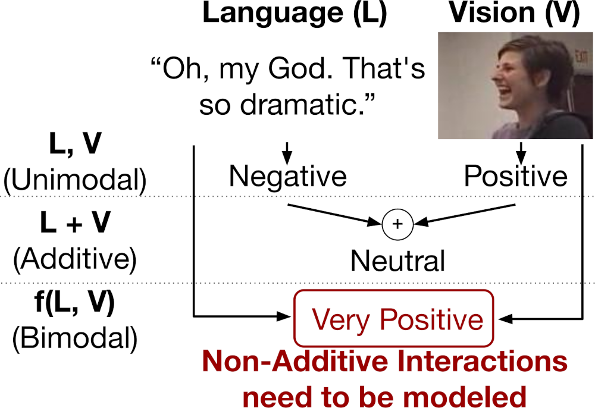

## About Me

I'm a final-year Ph.D. student in [Language and Information Technology](https://www.lti.cs.cmu.edu/) at [CMU](https://www.cmu.edu/) working in [Louis-Philippe Morency](https://www.cs.cmu.edu/~morency/)'s [MultiComp Lab](http://multicomp.cs.cmu.edu/).

**As a final-year CMU Ph.D. student, I'm excited to transition to an industry position with research-oriented projects. Please don't hesitate to reach out!**

## Interests

My expertise is application-inspired Machine Learning with the goal of socially aware AI technologies that benefit people by combining information from multiple modalities (through computer vision, speech processing, and natural language processing).

Examples of socially aware technologies that I helped create include:
1. developing behavior markers for symptoms of mental health;
2. automated estimation of social skills to improve public speaking; and
3. automated detection of sentiment, emotions, and mood.

-> For these AI applications, I focused on making them more transparent so that users can understand them better.

## Selected Publications

- ### Beyond Additive Fusion: Learning Non-Additive Multimodal Interactions
  </img>
  **Torsten Wörtwein**, Lisa B. Sheeber, Nicholas Allen, Jeffrey F. Cohn, Louis-Philippe Morency
   
  Findings of the Association for Computational Linguistics: EMNLP 2022. **F-EMNLP 2022**
   
  [[Paper](https://github.com/twoertwein/MultimodalResidualOptimization/raw/main/paper.pdf)] [[Code](https://github.com/twoertwein/MultimodalResidualOptimization/)]

- ### Human-Guided Modality Informativeness for Affective States
  **Torsten Wörtwein**, Lisa B. Sheeber, Nicholas Allen, Jeffrey F. Cohn, Louis-Philippe Morency
   
  ACM International Conference on Multimodal Interaction. **ICMI 2021**
   
  [[Paper](https://dl.acm.org/doi/10.1145/3462244.3481004)] [[Code](https://github.com/twoertwein/HumanGuidedAttention/)]

- ### Simple and Effective Approaches for Uncertainty Prediction in Facial Action Unit Intensity Regression
  **Torsten Wörtwein** and Louis-Philippe Morency
   
  IEEE International Conference on Automatic Face and Gesture Recognition. **FG 2020**
   
  [[Paper](https://ieeexplore.ieee.org/abstract/document/9320286)] [[Code](https://github.com/twoertwein/UncertaintyRegression)]

- ### Computational Analysis of Acoustic Descriptors in Psychotic Patients
  **Torsten Wörtwein**, Tadas Baltrusaitis, Eugene Laksana, Luciana Pennant, Elizabeth S. Liebson, Dost Öngür, Justin T. Baker, Louis-Philippe Morency
   
  Conference of the International Speech Communication Association. **INTERSPEECH 2017**
   
  [[Paper](https://www.isca-speech.org/archive_v0/Interspeech_2017/abstracts/0466.html)]

- ### What Really Matters - An Information Gain Analysis of Questions and Reactions in Automated PTSD Screenings
  **Torsten Wörtwein** and Stefan Scherer
   
  IEEE Conference on Affective Computing and Intelligent Interaction. **ACII 2017**
   
  [[Paper](https://ieeexplore.ieee.org/document/8273573)]

- ### Mobile Interactive Image Sonification for the Blind
  **Torsten Wörtwein**, Boris Schauerte, Karin Müller, Rainer Stiefelhagen
   
  International Conference on Computers Helping People with Special Needs. **ICCHP 2017**
   
  [[Paper](https://www.springerprofessional.de/en/mobile-interactive-image-sonification-for-the-blind/10341192)]

- ### Multimodal Public Speaking Performance Assessment
  **Torsten Wörtwein**, Mathieu Chollet, Boris Schauerte, Louis-Philippe Morency, Rainer Stiefelhagen, Stefan Scherer
   
  ACM International Conference on Multimodal Interaction. **ICMI 2015**
   
  [[Paper](https://dl.acm.org/doi/abs/10.1145/2818346.2820762)]

- ### Automatic Assessment and Analysis of Public Speaking Anxiety: A Virtual Audience Case Study
  **Torsten Wörtwein**, Louis-Philippe Morency, Stefan Scherer
   
  IEEE Conference on Affective Computing and Intelligent Interaction. **ACII 2015**
   
  [[Paper](https://ieeexplore.ieee.org/abstract/document/7344570/)]

- ### Exploring Feedback Strategies to Improve Public Speaking: An Interactive Virtual Audience Framework
  Mathieu Chollet\*, **Torsten Wörtwein**\*, Louis-Philippe Morency, Ari Shapiro, Stefan Scherer
   
  ACM International Joint Conference on Pervasive and Ubiquitous Computing. **UbiComp 2015**
   
  [[Paper](https://dl.acm.org/doi/abs/10.1145/2750858.2806060)]
